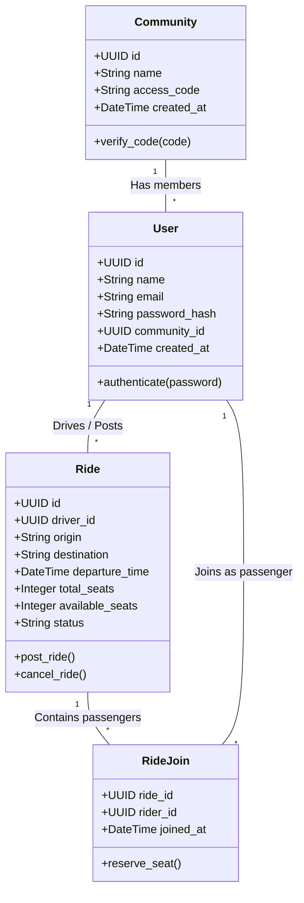

# Rihla: Final Project Report

## 1. Introduction & SDG Background (SDG 11)

As global urbanization accelerates, metropolitan areas and university campuses face unprecedented challenges regarding traffic congestion, parking availability, and carbon emissions. **Rihla** (the Arabic word for "Journey") is a community-driven ride-sharing web application developed to address these pressing urban mobility issues. 

This project is fundamentally aligned with the **United Nations Sustainable Development Goal 11 (SDG 11): Sustainable Cities and Communities**. SDG 11 aims to make cities and human settlements inclusive, safe, resilient, and sustainable. Specifically, Target 11.2 emphasizes providing access to safe, affordable, accessible, and sustainable transport systems for all. 

Rihla contributes to this goal by maximizing the occupancy of private vehicles already on the road. By creating a localized, community-scoped ecosystem (such as a university campus), Rihla encourages students and staff to carpool. This reduces the total number of single-occupancy vehicles, subsequently lowering the carbon footprint, reducing traffic congestion, and alleviating the heavy demand for parking infrastructure.

## 2. Problem Statement

Modern commercial ride-hailing services (e.g., Uber, Grab) are highly effective but suffer from three primary drawbacks when viewed through the lens of daily commuting for university students or office workers:
1. **Cost:** Daily reliance on commercial ride-hailing is financially unsustainable for most students.
2. **Trust & Safety:** Commuting with strangers can raise safety concerns, particularly for early morning or late-night travel.
3. **Environmental Impact:** Commercial services often introduce *more* vehicles onto the road, whereas the goal should be to utilize the empty seats in vehicles already making the commute.

Furthermore, traditional carpooling solutions lack a streamlined, unified platform. They often rely on disorganized WhatsApp groups or Facebook pages where matching riders and drivers is tedious, and tracking available seats is prone to error. There is a distinct need for a secure, closed-network application where trust is implicit (because all users belong to the same verified community) and the logistics of booking a seat are handled synchronously and safely.

## 3. System Objectives

To resolve the problems identified above, the Rihla application was designed with the following core objectives:
1. **Community-Scoped Security:** Restrict access so that only users with a valid community code (e.g., `CITYU-2026`) can view or post rides within that specific ecosystem.
2. **Unified User Profiles:** Eliminate the dichotomy between "Drivers" and "Riders." Any verified user should be able to post a ride if they are driving, or join a ride if they need a lift.
3. **Concurrency and Data Integrity:** Prevent "double-booking" of seats. If a ride has one seat left and two users attempt to join it at the exact same millisecond, the system must process them sequentially to prevent overbooking.
4. **Gamification and Engagement:** Implement a real-time leaderboard to rank users based on their total community participation (rides posted + rides joined) to incentivize carpooling.
5. **Decoupled Cloud Architecture:** Build a robust, scalable system separating the frontend client, backend API, and database, hosted entirely in the cloud.

## 4. Application Design (UML Class Diagram)

The system is designed around a relational database architecture. Below is the UML Class Diagram illustrating the core entities, their attributes, and their relationships.



**Key Relationships:**
* A **Community** has many **Users**.
* A **User** can post many **Rides** (One-to-Many).
* A **User** can join many **Rides** (Many-to-Many, resolved via the `RideJoin` junction table).

## 5. Implementation Details

The implementation of Rihla follows a modern, decoupled client-server architecture utilizing industry-standard frameworks and deployment platforms.

### 5.1 Frontend (Client-Side)
* **Technology:** HTML5, CSS3, and Vanilla JavaScript.
* **Architecture:** Single-Page Application (SPA) logic is utilized to dynamically hide and show different views (Home, Post, Leaderboard) without refreshing the browser.
* **State Management:** JSON Web Tokens (JWT) are stored in the browser's `localStorage` to persist user sessions.
* **Hosting:** Deployed via **Vercel** to provide a global, highly available Content Delivery Network (CDN) for static assets.

### 5.2 Backend (Server-Side)
* **Technology:** Python 3.11+ using the **FastAPI** framework.
* **Security:** Passwords are mathematically hashed using the `bcrypt` algorithm before storage. Endpoint protection is enforced via custom JWT Bearer dependencies, ensuring unauthenticated requests are rejected with a `401 Unauthorized` status.
* **Concurrency Handling:** The `POST /rides/{id}/join` endpoint utilizes SQLAlchemy's `with_for_update()` method. This issues a `SELECT FOR UPDATE` SQL command, locking the specific ride row in the database until the transaction completes, successfully eliminating race conditions.
* **Hosting:** Deployed as a web service on **Render.com**.

### 5.3 Database (Data Layer)
* **Technology:** **PostgreSQL**.
* **ORM:** **SQLAlchemy** is used for safe, parameterized SQL queries, protecting against SQL Injection attacks. **Alembic** is used for tracking and applying database schema migrations.
* **Hosting:** Hosted on **Neon.tech**, providing a scalable, serverless PostgreSQL environment.

## 6. Testing & Sample Outputs

Rigorous testing was conducted on the API endpoints to ensure data integrity and proper HTTP status code handling. 

### 6.1 Authentication Testing
When a user successfully registers or logs in, the backend securely returns a JWT token and minimal user profile.
**Sample Output (Login Success - 200 OK):**
```json
{
  "token": "eyJhbGciOiJIUzI1NiIsInR5cCI6IkpXVCJ9.eyJzdWIi...[truncated]",
  "user": {
    "id": "0b9d6742-94cd-4757-80b2-ddfd108d3c44",
    "name": "Khalid",
    "community_id": "3459e071-2df4-4987-a433-34746fb2f361"
  }
}
```

### 6.2 Concurrency & Business Logic Testing
The system correctly handles edge cases, such as a user attempting to join their own ride, or attempting to join a ride that is already full.
**Sample Output (Attempting to join a full ride - 400 Bad Request):**
```json
{
  "error": "No seats available."
}
```

### 6.3 Leaderboard Testing
The leaderboard successfully aggregates and sorts user participation in real-time, pulling counts directly from the SQL database to ensure accuracy.
**Sample Output (Leaderboard - 200 OK):**
```json
[
  {
    "id": "0b9d6742-94cd-4757-80b2-ddfd108d3c44",
    "name": "Khalid Ali",
    "rides_posted": 5,
    "rides_joined": 3,
    "total_rides": 8,
    "rank": 1
  }
]
```

## 7. Discussion & Limitations

### 7.1 Discussion
The project successfully demonstrated that a decoupled architecture (Vercel + Render + Neon) can yield a highly performant, scalable application at zero infrastructural cost for early-stage development. The choice of FastAPI allowed for rapid backend development with automatic validation (via Pydantic), severely reducing bugs related to malformed data payloads. The strict implementation of a unified profile system proved effective in simplifying the user experience compared to traditional apps that split driver and rider interfaces.

### 7.2 Limitations & Future Work
While the core objectives were met, the current iteration of Rihla has several limitations:
1. **Lack of Real-Time Maps:** The application currently uses text-based inputs for origin and destination. Future versions should integrate the Google Maps or Mapbox API for visual route mapping and distance estimation.
2. **No In-App Messaging:** Users currently lack a way to coordinate pickup details dynamically if someone is running late. Implementing a WebSocket-based chat feature would significantly improve the user experience.
3. **Manual Community Provisioning:** Currently, new communities (e.g., a new university joining the platform) must be seeded into the database manually by an administrator. An automated community-creation dashboard is required for large-scale expansion.

## 8. Conclusion

The Rihla project successfully delivers a secure, community-scoped ride-sharing platform that directly supports SDG 11 (Sustainable Cities and Communities). By providing a seamless, gamified, and highly secure environment for university students to carpool, the application incentivizes the reduction of single-occupancy vehicles. The robust implementation of PostgreSQL concurrency locks, JWT security, and a cloud-native decoupled architecture ensures that the system is both technically sound and highly scalable. Ultimately, Rihla demonstrates how localized software solutions can bridge the gap between environmental sustainability and everyday urban mobility.
